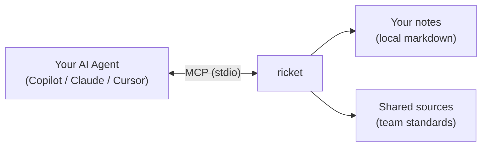

<p align="center">
  
</p>

# ricket

**Give your AI coding agent a memory.** Ricket is an MCP server that turns a folder of markdown notes into structured context your agent can search, read, and organize — so every session starts with your team's decisions, standards, and project history already loaded.

Works with **GitHub Copilot**, **Claude Code**, and **Cursor**. No Obsidian required — any folder of markdown files works.

---

## Why ricket?

AI coding agents are powerful but forgetful. Every new chat starts from zero. Ricket fixes that by giving your agent access to a persistent knowledge base:

- **Decisions** — "We chose SQLite over Postgres for the local index because…"
- **Standards** — "All API endpoints must follow our naming conventions…"
- **Concepts** — "Here's how our dependency injection works…"
- **Project context** — "The acme rewrite is tracked here…"

Your agent reads these notes through MCP tools, so it writes code that actually follows your architecture — not generic best-practice guesses.

### No Obsidian required

Ricket works with **any folder of markdown files**. If you already use Obsidian, great — ricket detects your vault structure and works alongside it. If you don't, ricket will scaffold a clean folder structure and templates for you. All you need is a directory and some `.md` files.

### Shared standards for teams

The killer feature for teams: **reference sources**. Point ricket at a shared folder (a git repo, a network drive, a synced directory) and every teammate's agent gets the same context:

```yaml
# ricket.yaml
sources:
  - name: standards
    path: ../shared-standards         # a shared git repo your team maintains
  - name: playbook
    path: /shared/engineering-playbook
```

Now when anyone on the team asks their agent to write an API endpoint, it finds your team's naming conventions. When someone asks about error handling, it finds your observability standards. The agents are all reading from the same playbook — literally.

Source notes are **read-only** and automatically included in search results. No one accidentally edits the shared standards through their agent.

---

## What it does

Ricket exposes 13 MCP tools that handle three jobs:

| Job | What happens |
|-----|-------------|
| **Context** | Your agent searches and reads your notes — decisions, standards, concepts, meeting history — so it codes with full awareness of your stack. |
| **Triage** | Drop raw notes, voice transcripts, or meeting dumps into an inbox. Your agent proposes where to file them, applies templates, tags, and links, and updates Maps of Content. |
| **Analysis** | Ricket detects your PKM system (PARA, Zettelkasten, LYT, GTD, Johnny.Decimal, and more), maps frontmatter schemas, link topology, and tag taxonomy so your agent understands *how* your notes are organized. |

Ricket makes **zero LLM API calls**. It is pure plumbing — the tool your agent calls, not the other way around.

---

## Quick start

### 1. Install

**VS Code (recommended)** — install the [Ricket extension](https://marketplace.visualstudio.com/items?itemName=AlejandroByrne.ricket) from the marketplace. It bundles the binary and auto-registers the MCP server. On first install, a popup asks you to select your vault folder using a native file picker — no manual path formatting needed. After selecting your folder, reload the window and you're ready to go.

You can also re-select the vault folder later: `Ctrl+Shift+P` → "Ricket: Select Vault Folder".

**From source:**

```bash
go install github.com/AlejandroByrne/ricket/cmd/ricket@latest
```

Or clone and build:

```bash
git clone https://github.com/AlejandroByrne/ricket
cd ricket
make build    # → bin/ricket
```

### 2. Configure your agent (non-extension installs)

If you installed via the VS Code extension, skip this step — the extension handles MCP registration automatically.

**VS Code (manual)** — add to `.vscode/mcp.json`:

```json
{
  "servers": {
    "ricket": {
      "type": "stdio",
      "command": "ricket",
      "args": ["--vault-root", "/path/to/your/notes"]
    }
  }
}
```

**Claude Code** — add to `~/.claude/mcp.json`:

```json
{
  "mcpServers": {
    "ricket": {
      "command": "ricket",
      "args": ["--vault-root", "/path/to/your/notes"]
    }
  }
}
```

### 3. Send the first prompt

Open your agent chat and send:

**Starting fresh:**
```
Run vault_analyze and help me set up a new ricket vault from scratch.
```

**Existing notes / Obsidian vault:**
```
Run vault_analyze and walk me through migrating my existing vault to ricket.
```

The agent inspects your folder, proposes a `ricket.yaml` config, scaffolds any missing structure, and writes a `VAULT_GUIDE.md` that teaches future sessions how your notes are organized. Reload your editor window and the full tool set is live.

---

## How it works



1. **Before config exists** — ricket starts in migration mode. Only `vault_analyze` and `vault_write_config` are available. Your agent uses these to understand your notes and generate `ricket.yaml`.

2. **After config exists** — ricket starts in full mode with all 13 tools. Your agent can search, read, triage, file, and create notes.

3. **Every session** — your agent calls ricket tools to read decisions and standards before writing code, and files new notes after meetings or design discussions.

---

## Reference sources (team shared context)

This is where ricket shines for teams. Add a `sources:` section to `ricket.yaml`:

```yaml
sources:
  - name: standards
    path: ../shared-standards      # relative to vault root, or absolute
  - name: team-playbook
    path: /shared/team-playbook
```

A source is just a folder of markdown files that your team maintains together — typically a git repo that everyone clones. Once configured:

- **`vault_search`** automatically includes matching source notes in results (tagged with their source name).
- **`vault_read_note`** reads source notes using `@source-name/path` syntax: `@standards/api-naming.md`.
- **`vault_list_sources`** shows all configured sources and whether they're available.

This means every developer on the team gets the same architectural decisions, the same API conventions, the same code review checklist injected into their agent's context — without anyone having to copy-paste or remember to attach files.

---

## Vault root resolution

Ricket resolves the vault root in this order:

| Priority | Source |
|----------|--------|
| 1 | `--vault-root` CLI flag |
| 2 | `RICKET_VAULT_ROOT` environment variable |
| 3 | `default_vault` in `~/.config/ricket/config.yaml` |
| 4 | Current working directory |

---

## MCP tools

### Setup tools (always available)

| Tool | Description |
|------|-------------|
| `vault_analyze` | Deep inspection of vault structure — folder tree, tags, naming patterns, templates, MOCs, inferred categories, PKM system detection, frontmatter schema, link topology, tag taxonomy. Safe to call on any directory. |
| `vault_write_config` | Write `ricket.yaml` and `VAULT_GUIDE.md`. Pass `scaffold: true` to create missing folders and template stubs. |

### Context & triage tools (available after config)

| Tool | Description |
|------|-------------|
| `vault_search` | Search by folder, tags, and/or full-text query. Automatically searches reference sources too. |
| `vault_read_note` | Read a note's content, frontmatter, tags, and wikilinks. Use `@source/path` for shared sources. |
| `vault_list_inbox` | List unprocessed notes in the inbox with previews. |
| `vault_triage_inbox` | Propose filing actions for inbox notes — category, destination, confidence, matched signals. |
| `vault_file_note` | Move a note from inbox to its destination with template, tags, links, and MOC update. |
| `vault_create_note` | Create a new note with optional template, tags, links, and MOC entry. |
| `vault_update_note` | Update an existing note's content, tags, or links in-place. |
| `vault_get_categories` | List all configured categories with their signal keywords. |
| `vault_get_templates` | List all templates with their section structure. |
| `vault_status` | Inbox count, total notes, category count. |
| `vault_list_sources` | List reference sources and their availability. |

---

## ricket.yaml reference

```yaml
vault:
  inbox: Inbox/             # where raw notes land
  archive: Archive/         # where old notes go
  templates: _templates/    # note templates

categories:
  - name: engineering-decision
    folder: Areas/Engineering/decisions/
    template: decision
    naming: use-{topic}.md
    tags: [decision, engineering]
    moc: Areas/Engineering/decisions/MOC.md
    signals: [decision, standard, convention]

sources:                              # shared context for teams
  - name: standards                   # referenced as @standards/path
    path: ../shared-standards
  - name: playbook
    path: /shared/engineering-playbook

mcp:
  name: ricket
  version: 0.5.1
  needsApproval: true   # require approval before filing
```

### Signals

`signals` are keywords that help your agent match inbox notes to categories. When the agent calls `vault_get_categories`, it sees these signals and uses them to propose filing destinations.

---

## Git audit trail

If your vault is a git repo, ricket auto-commits every `vault_file_note` and `vault_create_note`:

```
ricket: filed meeting-notes.md → Areas/Engineering/meetings/2026-03-17-sprint-planning.md
ricket: created Areas/Engineering/concepts/opentelemetry.md
```

Filter ricket operations:

```bash
git log --oneline --grep="ricket:"
```

---

## Using with Obsidian

Ricket works great with Obsidian but doesn't require it. If you do use Obsidian, these plugins pair well:

| Plugin | Why |
|--------|-----|
| **Obsidian Git** | Auto-syncs vault to remote; ricket commits appear in the git log |
| **Templater** | Ricket resolves `<% tp.file.title %>` and `<% tp.date.now(...) %>` placeholders |
| **Dataview** | MOC files can use Dataview queries to auto-list notes by tag |

---

## Development

```bash
make build    # compile to bin/ricket
make test     # go test ./...
make lint     # go vet ./...
make clean    # remove bin/ and .ricket/
```

### Architecture

```
cmd/ricket/          MCP server entry point
internal/
  config/            Config loading, multi-source resolution
  vault/             Core vault operations, search, analysis, PKM detection
  mcp/               MCP server, tool definitions, handlers
  git/               Git audit trail
vscode-extension/    VS Code extension (auto-registers ricket)
testdata/            Test fixtures (vault + shared-standards)
```
